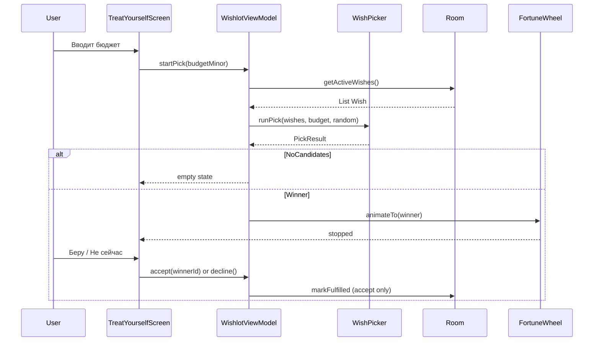

# Архитектура Wishlot

> Дата: 2026-05-18 · Вишлист + розыгрыш желания

## Поддерживаемые версии Android

| Параметр | Значение | Зачем |
|----------|----------|--------|
| `minSdk` | **26** (Android 8.0) | Требование продукта; каналы уведомлений при необходимости |
| `targetSdk` | 36 | Google Play |
| `compileSdk` | 36 | Актуальные API при сборке |

**GymProgress** (`minSdk 29`) на Android 8–9 **не ставится** — у Wishlot порог ниже, как у **VoiceMind**.

Специальных API ниже 26 для ядра MVP не требуется: Compose, Room, DataStore работают на 26+.

---

## Модули

```
:root
└── :app
```

Структура Gradle — копировать из **GymProgress** / **VoiceMind**:

- `gradle/libs.versions.toml`
- `version.properties` с auto bump patch на assemble
- `build.gradle.kts` (root + app)
- `applicationId`: `com.example.wishlot`

---

## Пакеты

```
com.example.wishlot/
├── MainActivity.kt
├── WishlotApplication.kt          # опционально
├── data/
│   ├── AppDatabase.kt
│   ├── Wish.kt
│   ├── WishDao.kt
│   ├── WishRepository.kt
│   ├── WishStatus.kt
│   ├── SettingsRepository.kt      # DataStore
│   ├── pick/
│   │   ├── WishPicker.kt          # filter + random (pure Kotlin)
│   │   └── PickResult.kt
│   └── backup/                      # фаза 5
│       └── BackupRepository.kt
├── viewmodel/
│   └── WishlotViewModel.kt
└── ui/
    ├── navigation/
    ├── screens/
    │   ├── WishlistScreen.kt
    │   ├── AddEditWishScreen.kt
    │   ├── TreatYourselfScreen.kt   # ввод бюджета + CTA
    │   ├── SpinResultScreen.kt      # колесо + решение
    │   ├── HistoryScreen.kt
    │   └── SettingsScreen.kt
    ├── components/
    │   ├── WishCard.kt
    │   ├── BudgetField.kt
    │   └── FortuneWheel.kt          # анимация
    └── theme/
        └── WishlotTheme.kt
```

---

## Поток «Побаловать себя»



---

## WishlotViewModel

**StateFlow:**

| Поле | Источник |
|------|----------|
| `activeWishes` | DAO `status = ACTIVE`, `createdAt ASC, id ASC` |
| `fulfilledWishes` | DAO `status = FULFILLED`, `fulfilledAt DESC` |
| `treatBudgetInput` | UI state + DataStore restore |
| `pickState` | Idle / Spinning / Result / Empty |
| `currentPickWinner` | `Wish?` после random |
| `settings` | DataStore |
| `errorMessage` | Snackbar |

**Методы:**

- `addWish` / `updateWish` / `deleteWish`
- `startPick(budgetMinor)` — фильтр + random + `pickState`
- `acceptPick()` — `FULFILLED`
- `declinePick()` — сброс `pickState`, желание не трогать
- `spinAgain()` — повтор `startPick` с тем же бюджетом
- `safeDb { }` — по образцу GymProgress

Бизнес-логику pick **не** держать в Composable.

---

## Навигация

| Таб | Экран |
|-----|--------|
| Вишлист | `WishlistScreen` — список ACTIVE, FAB «Добавить» |
| Побаловать себя | `TreatYourselfScreen` — бюджет, кнопка крутить |
| История | `HistoryScreen` — FULFILLED |
| Настройки | `SettingsScreen` — валюта, о приложении |

**Overlay** (как GymProgress / VoiceMind):

- `AddEditWishScreen`
- `SpinResultScreen` — колесо + «Беру» / «Не сейчас»

`BackHandler` на overlay закрывает без сохранения.

---

## Room

- DB: `wishlot_db`
- v1: таблица `wishes`
- Индексы: `(status)`, `(fulfilledAt)` для истории
- Миграции явные; destructive только debug

### Сортировки (обязательно стабильные)

| Список | ORDER BY |
|--------|----------|
| Активный вишлист | `createdAt ASC, id ASC` |
| История | `fulfilledAt DESC, id DESC` |

---

## WishPicker

```kotlin
object WishPicker {
    fun runPick(input: PickInput, random: Random = Random.Default): PickResult
}
```

Без зависимостей от Android — тесты в `test/`.

---

## FortuneWheel (UI)

- `FortuneWheel(winner: Wish, candidates: List<Wish>, onSpinEnd: () -> Unit)`
- Анимация: `Animatable` / `animateFloatAsState` + фиксированная длительность 2–3 с
- `winner` передаётся из ViewModel **до** анимации; угол остановки вычисляется под `winner`

---

## Референс GymProgress / VoiceMind

| Брать | Не брать |
|-------|----------|
| Gradle, `version.properties`, KSP Room | Скоринг, упражнения |
| Compose + Material 3 + Navigation Suite | STT, AlarmManager |
| Один ViewModel, `safeDb`, overlay | Парсер напоминаний |
| DataStore | IRON CORE / CLEAR BELL палитры |
| Lint `ContentDescription` (GymProgress) | — |

---

## Тестирование

| Уровень | Что |
|---------|-----|
| Unit | `WishPicker`, форматирование цены |
| Unit | ViewModel с fake Repository |
| Instrumented | DAO insert/update/status |
| Manual | 0 кандидатов, 1, много; accept/decline/spin again |

---

## Связанные документы

- [WISH_PICK_LOGIC.md](WISH_PICK_LOGIC.md)
- [FOLDER_STRUCTURE.md](FOLDER_STRUCTURE.md)
- [FEATURE_PLAN.md](FEATURE_PLAN.md)
- [DESIGN_SYSTEM.md](DESIGN_SYSTEM.md)
