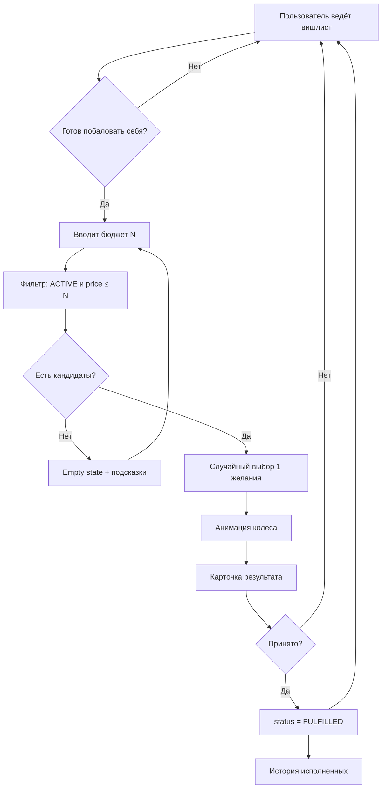

# Бизнес-процесс Wishlot

> Дата: 2026-05-18

Документ описывает сквозной процесс от идеи покупки до отметки «исполнено». Это **контракт** для UI, ViewModel и тестов.

---

## Участники и артефакты

| Роль | Описание |
|------|----------|
| Пользователь | Владелец вишлиста |
| Желание (Wish) | Запись: название, цена, статус |
| Бюджет сессии | Сумма «готов потратить сейчас», вводится перед розыгрышем |
| Результат розыгрыша | Одно выбранное `ACTIVE`-желание |
| Решение | Принято → `FULFILLED`; закрыть → без изменений |

---

## Диаграмма процесса (высокий уровень)



---

## Этап 1. Наполнение вишлиста

**Цель:** накопить осознанный список желаний, а не покупать сразу.

| Шаг | Действие | Правило |
|-----|----------|---------|
| 1.1 | Добавить желание | `title` не пустой, `price > 0` |
| 1.2 | Хранить | `status = ACTIVE` |
| 1.3 | Просматривать список | Только `ACTIVE` на вкладке «Вишлист» |
| 1.4 | Редактировать | Можно менять цену до исполнения |
| 1.5 | Удалить | Физическое удаление или soft-delete — в MVP удаление из БД с confirm |

**Инвариант:** исполненное желание не участвует в розыгрыше.

---

## Этап 2. Решение о бюджете

**Цель:** привязать импульс «хочу что-то купить» к **конкретной сумме**.

| Шаг | Действие | Правило |
|-----|----------|---------|
| 2.1 | Открыть «Побаловать себя» | Отдельный экран / вкладка |
| 2.2 | Ввести бюджет | Положительное число; сохранять в DataStore как `lastTreatBudgetMinor` |
| 2.3 | Нажать «Крутить» / «Выбрать» | Запускает фильтр и random (не помечает исполненным автоматически) |

**Инвариант:** бюджет **не списывается** с реального счёта — только логический фильтр в приложении.

---

## Этап 3. Фильтрация кандидатов

См. [WISH_PICK_LOGIC.md](WISH_PICK_LOGIC.md).

Кратко:

```
candidates = wishes.where { it.status == ACTIVE && it.priceMinor <= budgetMinor }
```

| Исход | UX |
|-------|-----|
| `candidates.isEmpty()` | Текст: «Нет желаний до {budget}». Кнопки: изменить бюджет, перейти в вишлист |
| `candidates.size >= 1` | Анимация колеса или карточка результата |

---

## Этап 4. Случайный выбор и презентация

| Шаг | Действие | Правило |
|-----|----------|---------|
| 4.1 | Выбрать индекс | Равномерный random по `candidates` |
| 4.2 | Показать анимацию | Визуально крутится рулетка (картинка `ic_launcher_foreground`) ~3 с |
| 4.3 | По окончании анимации — показать карточку | Название, цена, заметка; кнопка «Принято» |

**Инвариант:** результат определяется **до** окончания анимации, но карточка показывается **только** после остановки рулетки.

---

## Этап 5. Решение пользователя

### 5.1 Принятие («Принято»)

| Шаг | Действие |
|-----|----------|
| 5.1.1 | `status → FULFILLED`, `fulfilledAt = now` |
| 5.1.2 | Убрать из активного вишлиста |
| 5.1.3 | Показать в истории |

**Бизнес-смысл:** пользователь **зафиксировал намерение** исполнить это желание в рамках своего бюджета (реальная покупка — вне приложения).

### 5.2 Отмена (закрытие экрана)

| Шаг | Действие |
|-----|----------|
| 5.2.1 | Статус не меняется |
| 5.2.2 | Вернуться к экрану бюджета |

**Примечание:** «Крутить снова» убрано из MVP — пользователь может нажать «Крутить» заново вручную.

---

## Сводка бизнес-правил

| # | Правило |
|---|---------|
| BR-1 | В розыгрыше только `ACTIVE` |
| BR-2 | Цена желания ≤ введённого бюджета |
| BR-3 | Random равномерный по кандидатам |
| BR-4 | `FULFILLED` только после явного согласия |
| BR-5 | Отмена экрана не меняет статус |
| BR-6 | Одно желание — один финальный статус `FULFILLED` (без «отменить исполнение» в MVP) |

---

## Этап 6. История

| Шаг | Действие |
|-----|----------|
| 6.1 | Список `FULFILLED`, новые сверху |
| 6.2 | Карточка: название, цена, дата исполнения |
| 6.3 | (Позже) сводка: сумма исполненных за месяц |

---

## Сводка бизнес-правил

| # | Правило |
|---|---------|
| BR-1 | В розыгрыше только `ACTIVE` |
| BR-2 | Цена желания ≤ введённого бюджета |
| BR-3 | Random равномерный по кандидатам |
| BR-4 | `FULFILLED` только после явного согласия |
| BR-5 | Отмена экрана не меняет статус |
| BR-6 | Одно желание — один финальный статус `FULFILLED` (без «отменить исполнение» в MVP) |

---

## Открытые вопросы (на согласование)

1. **Отмена исполнения** — разрешить вернуть в `ACTIVE` из истории? *Рекомендация MVP: нет.*
2. **Один кандидат** — показывать колесо или сразу карточку? *Рекомендация: короткая анимация 0.5–1 с.*
3. **Нулевой бюджет** — блокировать кнопку «Крутить». *Да.*

---

## Связанные документы

- [WISH_PICK_LOGIC.md](WISH_PICK_LOGIC.md)
- [PROJECT_OVERVIEW.md](PROJECT_OVERVIEW.md)
- [ARCHITECTURE.md](ARCHITECTURE.md)
